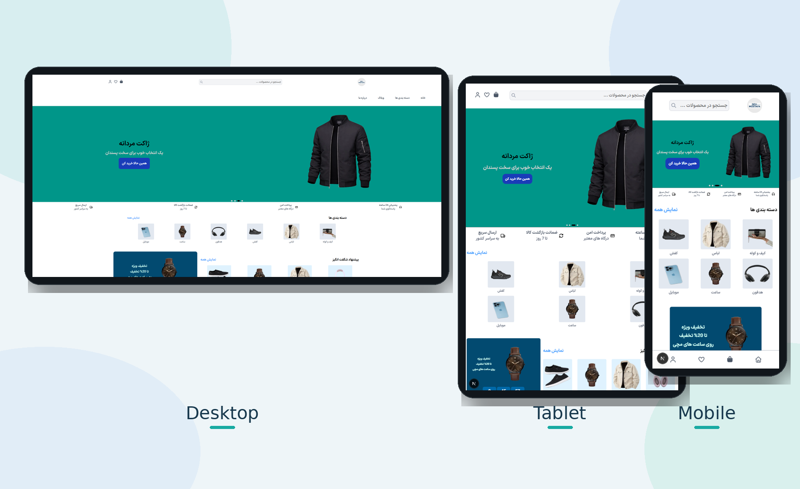

# 🛒 Shopping Website

A responsive e-commerce website built with **Next.js**.
This project was created as a practice and portfolio project to demonstrate frontend development skills, state management, API integration, authentication flow, and responsive UI design.

## ✨ Features

* 🛍️ Browse and display products
* 🔍 Product search
* 📂 Product categories
* 📄 Product details page
* 🛒 Shopping cart
* ❤️ Add and remove favorite products
* 🔐 User authentication
* 👤 User profile
* 🔄 Manage product quantity
* 📱 Fully responsive design
* ⏳ Loading and error states
* 🚫 Custom 404 page
* 🌙 Modern and responsive UI
* 🎞️ Animations with Framer Motion

## 🛠️ Technologies

* **Next.js**
* **React**
* **JavaScript**
* **Redux Toolkit**
* **Axios**
* **Framer Motion**
* **Tailwind CSS**
* **DummyJSON API**

## 📡 API

This project uses the [DummyJSON API](https://dummyjson.com/) for product and user data.

The API is used for:

* Product data
* Product categories
* Product search
* User authentication
* User information

> This project uses DummyJSON as a practice API and does not have a custom backend.


## 🚀 Getting Started

### 1. Clone the repository

```bash
git clone https://github.com/Dev-MostafaAzari/Shopping-Website.git
```

### 2. Navigate to the project

```bash
cd shopwebsite
```

### 3. Install dependencies

```bash
npm install
```

### 4. Run the development server

```bash
npm run dev
```

Open http://localhost:3000 in your browser.

## 🔑 Environment Variables

create a `.env.local` file in the root directory:

```env
NEXT_PUBLIC_PRODUCTS_API_URL=https://dummyjson.com
```

## 🌐 LiveDemo

///

## 📸 Preview





## 🎯 Project Goals

The main purpose of this project was to practice and demonstrate:

* Building applications with Next.js
* Working with React components
* Managing global state with Redux Toolkit
* Fetching data from REST APIs
* Handling authentication flows
* Creating responsive layouts
* Working with dynamic routes
* Using Server and Client Components
* Managing loading and error states
* Creating reusable components
* Deploying a Next.js application

## 🔮 Future Improvements

Some possible improvements for future versions:

* Add a custom backend
* Add a real database
* Implement real payment functionality
* Improve authentication with a custom backend
* Add product reviews
* Add order management
* Add server-side data persistence

## 📄 License

This project is created for educational and portfolio purposes.

